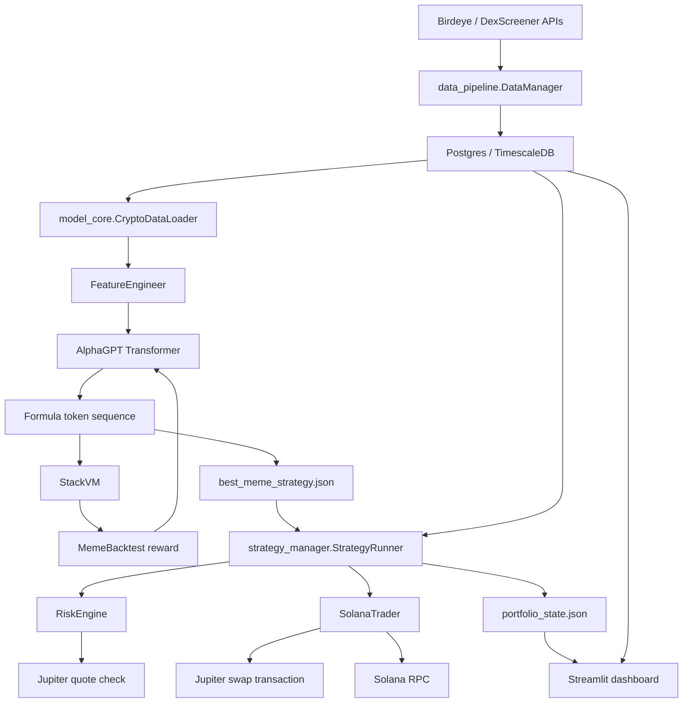

# AlphaGPT 项目分析文档

分析日期：2026-06-30  
分析范围：仓库根目录下的 Python 源码、README、依赖清单、数据/模型/策略/执行/dashboard 模块。  
本地验证：已执行 `python3 -m compileall -q .`，当前源码通过 Python 语法编译检查；未连接外部 Postgres、Birdeye、Solana RPC 或 Jupiter 做端到端实盘验证。

## 1. 项目定位

AlphaGPT 是一个面向 Solana meme token 的自动化量化系统。它的核心不是直接预测价格，而是让一个小型 Transformer 生成可解释的因子公式，再通过 StackVM 执行公式、用回测奖励筛选公式，最后把高分公式接入实时扫描、风控和 Jupiter 交易执行。

项目可以拆成五条主线：

- 数据管道：从 Birdeye 拉取热门 token 和 OHLCV，写入 Postgres/TimescaleDB。
- 因子挖掘：构造行情特征，用 Transformer 生成公式 token 序列，用回测打分训练。
- 策略运行：周期同步数据、执行公式、扫描买点、监控持仓和卖点。
- 交易执行：通过 Solana RPC 查询余额，通过 Jupiter 报价、构造 swap transaction、签名并发送。
- 可视化：Streamlit dashboard 展示钱包、持仓、市场快照和日志。

## 2. 仓库规模与结构

当前源码规模约 3190 行 Python。主要目录如下：

```text
AlphaGPT/
├── data_pipeline/        # 数据发现、行情拉取、数据库写入
├── model_core/           # 特征工程、公式词表、StackVM、模型、训练和回测
├── strategy_manager/     # 实盘策略循环、风控、持仓状态
├── execution/            # Solana RPC、Jupiter 报价/下单/签名
├── dashboard/            # Streamlit 看板
├── lord/                 # LoRD 正则化研究实验
├── paper/                # 研究材料 PDF
├── assets/               # README/展示图片
├── times.py              # A 股/ETF 公式挖掘独立实验脚本
├── README.md             # 原项目展示页，信息很少
├── CATREADME.md          # 已有速读版中文说明
├── requirements.txt      # 主流程依赖
└── requirements-optional.txt
```

## 3. 总体架构



## 4. 主运行链路

### 4.1 数据入库

入口：`python3 -m data_pipeline.run_pipeline`

调用路径：

```text
data_pipeline/run_pipeline.py
  -> DataManager.initialize()
  -> DBManager.connect()
  -> DBManager.init_schema()
  -> DataManager.pipeline_sync_daily()
  -> BirdeyeProvider.get_trending_tokens()
  -> BirdeyeProvider.get_token_history()
  -> DBManager.upsert_tokens()
  -> DBManager.batch_insert_ohlcv()
```

数据库表：

- `tokens(address primary key, symbol, name, decimals, chain, last_updated)`
- `ohlcv(time, address, open, high, low, close, volume, liquidity, fdv, source)`

`ohlcv` 会尝试转换为 TimescaleDB hypertable；如果没有 TimescaleDB extension，会退化为普通 Postgres 表。

关键配置在 `data_pipeline/config.py`：

- `DB_USER` / `DB_PASSWORD` / `DB_HOST` / `DB_PORT` / `DB_NAME`
- `BIRDEYE_API_KEY`
- `BIRDEYE_BASE_URL`
- `TIMEFRAME = "1m"`
- `MIN_LIQUIDITY_USD = 500000.0`
- `MIN_FDV = 10000000.0`
- `HISTORY_DAYS = 7`
- `CONCURRENCY = 20`

### 4.2 训练公式生成器

入口：`python3 -m model_core.engine`

调用路径：

```text
model_core/engine.py
  -> CryptoDataLoader.load_data()
  -> FeatureEngineer.compute_features()
  -> AlphaGPT autoregressive sampling
  -> StackVM.execute()
  -> MemeBacktest.evaluate()
  -> policy-gradient update
  -> best_meme_strategy.json
  -> training_history.json
```

训练方法是近似 REINFORCE：

1. 用当前模型逐步采样 `MAX_FORMULA_LEN = 12` 个 token。
2. StackVM 将 token 序列解释成因子时间序列。
3. 回测器把因子转成交易信号并计算 reward。
4. 对 reward 做标准化，更新采样 log probability。
5. 保存全局最高分公式到 `best_meme_strategy.json`。

模型 `model_core/alphagpt.py` 的主要组件：

- token embedding + positional embedding
- Looped Transformer layer
- RMSNorm
- QK normalization
- SwiGLU FFN
- MTPHead 多任务输出头
- critic head
- Newton-Schulz Low-Rank Decay 正则化
- StableRankMonitor

注意：训练代码目前没有使用 critic value，也没有显式使用 MTPHead 的 task probabilities 做多目标 loss；它们更像预留或实验性结构。

### 4.3 实盘策略循环

入口：`python3 -m strategy_manager.runner`

调用路径：

```text
strategy_manager/runner.py
  -> 读取 best_meme_strategy.json
  -> DataManager.initialize()
  -> SolanaTrader.rpc.get_balance()
  -> 每 15 分钟同步数据管道
  -> CryptoDataLoader.load_data(limit_tokens=300)
  -> monitor_positions()
  -> scan_for_entries()
  -> RiskEngine.check_safety()
  -> SolanaTrader.buy()/sell()
  -> PortfolioManager 写入 portfolio_state.json
```

循环行为：

- 每轮检查 `STOP_SIGNAL` 文件，支持 dashboard 紧急停止。
- 每 15 分钟运行一次数据同步。
- 每轮重新从数据库加载最近 token 的特征。
- 对已有持仓执行止损、止盈、移动止损和 AI 退出判断。
- 如果未达到最大持仓数，就对最新信号排序并尝试开仓。

策略参数在 `strategy_manager/config.py`：

- `MAX_OPEN_POSITIONS = 3`
- `ENTRY_AMOUNT_SOL = 2.0`
- `STOP_LOSS_PCT = -0.05`
- `TAKE_PROFIT_Target1 = 0.10`
- `TRAILING_ACTIVATION = 0.05`
- `TRAILING_DROP = 0.03`
- `BUY_THRESHOLD = 0.85`
- `SELL_THRESHOLD = 0.45`

### 4.4 交易执行

入口类：`execution.trader.SolanaTrader`

依赖：

- `QUICKNODE_RPC_URL`
- `SOLANA_PRIVATE_KEY`
- Jupiter v6 quote/swap API
- `solders`
- `solana-py`

买入流程：

```text
get_balance()
  -> Jupiter get_quote(SOL -> token)
  -> Jupiter get_swap_tx()
  -> deserialize_and_sign()
  -> send_and_confirm()
```

卖出流程：

```text
get_token_accounts_by_owner_json_parsed()
  -> 计算卖出 raw balance
  -> Jupiter get_quote(token -> SOL)
  -> Jupiter get_swap_tx()
  -> deserialize_and_sign()
  -> send_and_confirm()
```

这是实盘交易代码，会用配置的私钥签名并发送主网交易。任何运行 `strategy_manager.runner` 或直接调用 `execution.trader` 前，都应先确认钱包、RPC、滑点、仓位和风控参数。

### 4.5 Dashboard

入口：`streamlit run dashboard/app.py`

Dashboard 展示：

- SOL 钱包余额
- 当前 `portfolio_state.json` 持仓
- 数据库最新市场快照
- `best_meme_strategy.json` 当前策略
- `strategy.log` 最近日志
- `STOP_SIGNAL` 紧急停止按钮

注意：代码中没有配置 Loguru 写入 `strategy.log` 的 sink，因此 dashboard 的日志页默认可能为空，除非外部启动脚本把日志重定向或另行配置。

## 5. 核心数据结构

### 5.1 行情张量

`CryptoDataLoader.load_data()` 从数据库读取 token 列表和 OHLCV，pivot 成张量：

```text
raw_data_cache[col]: [num_tokens, num_time_steps]
feat_tensor:          [num_tokens, num_features, num_time_steps]
target_ret:           [num_tokens, num_time_steps]
```

`target_ret` 使用未来 open-to-open 对数收益：

```text
target_ret[t] = log(open[t+2] / open[t+1])
```

最后两个时间点置零，避免未来值越界。

### 5.2 公式词表

位置：`model_core/vocab.py`

当前主流程特征 6 个：

- `RET`
- `LIQ_SCORE`
- `PRESSURE`
- `FOMO`
- `DEV`
- `LOG_VOL`

当前主流程算子 12 个：

- `ADD`
- `SUB`
- `MUL`
- `DIV`
- `NEG`
- `ABS`
- `SIGN`
- `GATE`
- `JUMP`
- `DECAY`
- `DELAY1`
- `MAX3`

词表大小为 18。feature token 从 0 开始，operator token 从 6 开始。

### 5.3 公式执行

位置：`model_core/vm.py`

StackVM 使用逆波兰表达式风格：

- 遇到 feature token：把对应特征时间序列压栈。
- 遇到 operator token：按 arity 从栈中弹出参数，执行算子，再把结果压回。
- 最终栈里必须只剩一个张量，否则公式非法。

非法公式、参数不足、NaN/Inf、结果常数等都会被训练或调用路径惩罚/忽略。

## 6. 模块详解

### 6.1 data_pipeline

职责：

- 发现候选 token。
- 拉取历史 K 线。
- 初始化并写入数据库。

主要文件：

- `config.py`：数据库、Birdeye、过滤阈值配置。
- `db_manager.py`：asyncpg 连接池、schema 初始化、批量写入。
- `data_manager.py`：主编排器。
- `providers/birdeye.py`：当前实际使用的 Birdeye provider。
- `providers/dexscreener.py`：部分实现，当前不提供 trending/history。
- `fetcher.py`：旧版 Birdeye 拉取器，主流程未使用。
- `processor.py`：Pandas 清洗和基础因子函数，主流程未使用。

当前状态：

- Birdeye 是实际主数据源。
- DexScreener provider 只实现了批量 token details，trending/history 返回空。
- `DataProcessor` 和 `fetcher.py` 看起来是历史遗留或未接线代码。

### 6.2 model_core

职责：

- 计算特征。
- 定义可解释公式语言。
- 训练公式生成模型。
- 回测并输出最优公式。

主要文件：

- `factors.py`：meme token 特征工程。
- `ops.py`：公式算子。
- `vocab.py`：特征和算子的统一 token 词表。
- `vm.py`：StackVM 解释执行公式。
- `alphagpt.py`：Transformer 公式生成器和 LoRD 相关组件。
- `data_loader.py`：从 DB 构造训练张量。
- `backtest.py`：交易信号和 reward 计算。
- `engine.py`：训练主循环。

当前状态：

- `FeatureEngineer` 主流程只使用 6 个特征。
- `AdvancedFactorEngineer` 提供 12 个特征，但未被 `CryptoDataLoader` 使用。
- 主训练没有 action mask，所以大量采样公式可能非法，只能靠负奖励筛掉。
- `times.py` 里有更严格的公式合法性 mask，但没有迁移到主流程。
- `ModelConfig.INPUT_DIM` 来自词表 feature count，和 `FeatureEngineer.INPUT_DIM` 一致。

### 6.3 strategy_manager

职责：

- 加载训练产物。
- 周期同步数据和扫描 token。
- 执行入场/出场逻辑。
- 管理本地持仓状态。

主要文件：

- `runner.py`：实盘主循环。
- `risk.py`：流动性和可卖性检查，基于 Jupiter quote 粗略排除不可卖 token。
- `portfolio.py`：本地 JSON 持仓状态。
- `config.py`：策略阈值和仓位参数。

当前状态：

- 持仓状态只落在本地 `portfolio_state.json`，不是链上余额的完整真相。
- 买入后用 quote 的 `outAmount` 估算持仓数量和入场价。
- 卖出时实际查链上 token account balance。
- STOP 信号靠文件传递，简单但有效。

### 6.4 execution

职责：

- 钱包私钥解析。
- RPC 查询余额和发送交易。
- Jupiter quote/swap API 封装。

主要文件：

- `config.py`：RPC、私钥、mint 地址、滑点配置。
- `rpc_handler.py`：Solana RPC client。
- `jupiter.py`：Jupiter quote/swap transaction。
- `trader.py`：买卖逻辑。
- `utils.py`：mint decimals 查询。

当前状态：

- `QuickNodeClient.get_token_balance()` 还未实现。
- `send_and_confirm()` 的 `max_retries` 参数未使用。
- 私钥支持 base58 或 JSON bytes 两种格式。
- 默认 RPC URL 是占位文本，未配置时会失败。

### 6.5 dashboard

职责：

- 查看当前钱包和策略状态。
- 查看持仓和市场快照。
- 发送紧急 STOP 信号。

主要文件：

- `app.py`：Streamlit 页面。
- `data_service.py`：读 DB、钱包、portfolio、strategy、log。
- `visualizer.py`：Plotly 图表。

当前状态：

- `app.py` 使用 `from data_service import ...` 这种局部导入，适合 `streamlit run dashboard/app.py`。
- 持仓 PnL 估算使用 `highest_price`，不是实时 mark price。
- dashboard 显示 `Open Positions / 5`，但策略配置 `MAX_OPEN_POSITIONS = 3`，展示和策略不一致。

### 6.6 lord 和 times.py

`lord/experiment.py` 是 LoRD 正则化研究脚本，用 modular addition/grokking 实验比较 L2 和 LowRank decay，并输出 `phase_diagram.png` 或 `mechanism_analysis.png`。

`times.py` 是独立的 A 股/ETF 公式挖掘实验：

- 使用 Tushare 获取 `511260.SH` 数据。
- 有独立的特征、算子、Transformer、严格公式 mask、回测和 OOS 检查。
- 输出 `strategy_performance.png`。

这两个脚本不参与 Solana meme token 主流程，但对理解项目作者的研究思路很有帮助。

## 7. 运行前置条件

### 7.1 Python 环境

建议 Python 3.10+，依赖安装：

```bash
pip install -r requirements.txt
pip install -r requirements-optional.txt
```

主流程依赖：

- torch
- pandas / numpy
- sqlalchemy / asyncpg / psycopg2-binary
- aiohttp
- python-dotenv
- loguru / tqdm
- solders / solana / base58
- streamlit / plotly

可选实验依赖：

- matplotlib
- seaborn
- tushare

### 7.2 环境变量

建议补一个 `.env.example`。当前代码涉及这些环境变量：

```text
DB_USER
DB_PASSWORD
DB_HOST
DB_PORT
DB_NAME
BIRDEYE_API_KEY
BIRDEYE_BASE_URL
QUICKNODE_RPC_URL
SOLANA_PRIVATE_KEY
STOP_SIGNAL_PATH
```

### 7.3 外部服务

必须具备：

- Postgres，最好带 TimescaleDB extension。
- Birdeye API key。
- Solana RPC endpoint。
- Jupiter API 可访问。
- 实盘钱包私钥和 SOL 余额。

## 8. 常用命令

初始化数据：

```bash
python3 -m data_pipeline.run_pipeline
```

训练公式：

```bash
python3 -m model_core.engine
```

运行实盘策略：

```bash
python3 -m strategy_manager.runner
```

启动看板：

```bash
streamlit run dashboard/app.py
```

运行 LoRD 实验：

```bash
python3 lord/experiment.py --mode mechanism
python3 lord/experiment.py --mode phase_diagram
```

运行 A 股/ETF 实验：

```bash
python3 times.py
```

## 9. 主要产物

训练产物：

- `best_meme_strategy.json`：最佳公式 token 序列，实盘策略必须依赖。
- `training_history.json`：训练过程指标。

实盘产物：

- `portfolio_state.json`：本地持仓状态。
- `STOP_SIGNAL`：dashboard 或人工创建的停止信号。
- `strategy.log`：dashboard 期望读取的日志文件，但当前代码未自动配置写入。

研究产物：

- `phase_diagram.png`
- `mechanism_analysis.png`
- `strategy_performance.png`
- `data_cache_final.parquet`

这些产物大多未纳入 `.gitignore`，实际运行前建议补充忽略规则，避免误提交交易状态、训练结果或缓存。

## 10. 当前风险与问题

### 10.1 安全风险

- `times.py` 中硬编码了 Tushare token，应移入环境变量并轮换该 token。
- 实盘交易依赖 `SOLANA_PRIVATE_KEY`，任何误运行都可能发主网交易。
- 缺少 `.env.example` 和配置校验，默认值里有 `password`、占位 RPC 等容易造成误判。

### 10.2 生产可用性风险

- 没有自动化测试。
- 没有 dry-run / paper-trading 模式。
- 没有交易前二次确认或全局只读模式。
- `portfolio_state.json` 是本地估算状态，可能与链上真实余额漂移。
- Jupiter quote 成功只能说明路径存在，不能完整证明无 honeypot 或税费风险。
- dashboard 的日志读取和策略日志写入没有真正接上。

### 10.3 数据一致性风险

- `data_pipeline/config.py` 使用 `DB_PORT`，但 `model_core/config.py` 和 `dashboard/data_service.py` 固定使用 5432，配置不一致。
- `CryptoDataLoader` 的 token 选择 `SELECT address FROM tokens LIMIT ...` 没有排序，训练/推理样本可能不稳定。
- `batch_insert_ohlcv()` 用 `copy_records_to_table` 写带主键的表，遇到重复时捕获 `UniqueViolationError` 后直接忽略，可能导致整批部分新数据也没有写入。
- `DataProcessor.clean_ohlcv()` 如果未来接入，需要按 address 分组做 ffill；当前实现是全局排序后填充，可能跨 token 串值。

### 10.4 模型和策略风险

- 主训练没有公式合法性 action mask，训练效率会被非法公式拖低。
- 起始 token 使用 0，而 0 同时也是 `RET` 特征 token，没有显式 BOS token。
- `head_critic`、`MTPHead.task_probs` 当前基本未进入优化目标。
- `AdvancedFactorEngineer` 未接入主训练，实际只有 6 个特征生效。
- `ModelConfig.MIN_LIQUIDITY = 5000`、`MemeBacktest.min_liq = 500000`、`RiskEngine` 里硬编码 5000，流动性阈值不一致。
- dashboard 展示最大持仓 5，但策略配置最大持仓 3。

### 10.5 代码维护风险

- `data_pipeline/fetcher.py` 和 `providers/birdeye.py` 两套 Birdeye 逻辑并存，容易误改错路径。
- `DexScreenerProvider` 未完成，但 `DataManager` 已实例化，容易让人误以为已启用。
- `execution/rpc_handler.py` 的 `get_token_balance()` 是空实现。
- 没有统一 package 配置，例如 `pyproject.toml`。
- 没有统一日志配置、启动脚本、健康检查或部署说明。

## 11. 推荐改造优先级

### P0：先保证不会误伤实盘资金

1. 增加 `DRY_RUN=true` 默认模式，未显式关闭前禁止发送交易。
2. 增加启动前配置校验：RPC、私钥、DB、Birdeye key、策略文件都必须明确检查。
3. 移除 `times.py` 的硬编码 Tushare token，改用环境变量。
4. 给 `portfolio_state.json`、训练产物、缓存、STOP 文件、日志补 `.gitignore`。

### P1：让主流程可复现

1. 增加 `.env.example`。
2. 增加 README 的真实运行手册。
3. 为数据同步、公式执行、回测、risk check 增加最小单元测试。
4. 固定 token selection 排序，例如按最新 liquidity 或 last_updated。
5. 统一 DB URL 构造，所有模块都使用 `DB_PORT`。

### P2：提升模型训练效率

1. 把 `times.py` 的合法公式 action mask 迁移到 `model_core.engine`。
2. 增加显式 BOS/PAD token，避免 0 同时代表 seed 和 `RET`。
3. 明确是否启用 12 维 advanced features，并同步词表、模型输入和文档。
4. 如果保留 critic head，加入 actor-critic loss；否则删掉未使用结构。
5. 保存公式时同时保存可读表达式、词表版本、训练数据窗口和回测指标。

### P3：提升实盘可靠性

1. 用链上余额和成交回执校准 `portfolio_state.json`。
2. 实现 `QuickNodeClient.get_token_balance()` 并在买卖后做 reconciliation。
3. 增加 slippage、price impact、quote freshness、失败重试和熔断策略。
4. 把 `strategy.log` 接入 Loguru sink，让 dashboard 日志真实可见。
5. 将 STOP 信号升级为更明确的控制状态，例如 `RUNNING/STOP_REQUESTED/STOPPED`。

## 12. 接手建议

如果要快速把项目跑起来，建议按这个顺序推进：

1. 先补 `.env.example` 和 `.gitignore`，避免密钥或状态文件泄漏。
2. 启动本地 Postgres，运行 `python3 -m data_pipeline.run_pipeline` 确认表和数据。
3. 用小 batch、小 token 数跑 `python3 -m model_core.engine`，确认能生成 `best_meme_strategy.json`。
4. 先实现 dry-run 策略 runner，只打印将要买卖的 token 和 quote，不发送交易。
5. 再启动 dashboard，确认 portfolio、market overview、STOP_SIGNAL 能正常工作。
6. 最后才接入真实私钥和主网交易，并限制钱包资金规模。

整体来看，AlphaGPT 的研究想法很清晰：把“公式生成”和“交易执行”分层，模型只负责产生可解释信号，实盘层只消费信号分数。但当前工程状态更接近研究原型和实盘草案之间：主路径已经串起来了，仍需要配置校验、dry-run、安全边界、测试和状态 reconciliation 才适合作为真实资金系统长期运行。
